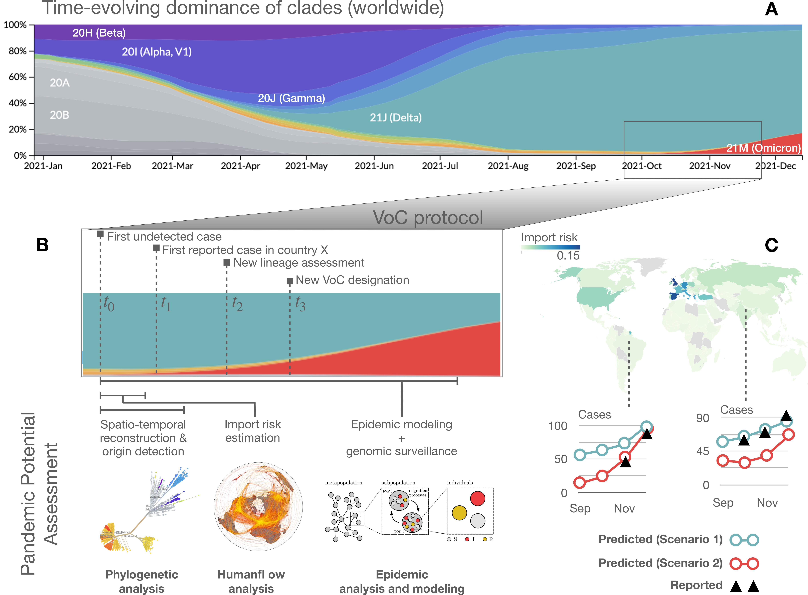

# Multivariate Early-Stage Characterization of Emerging Variants (MESCEV)

 


This is the software repository of the manuscript "Enhancing global preparedness during an ongoing pandemic from partial and noisy data" (https://www.medrxiv.org/content/10.1101/2022.08.19.22278981v2).
It is a 3-stage evaluation framework of the pandemic potential of an emerging variant from partial and noisy data. It combines a phylogenetic analysis of the first submitted sequenced samples, the import risk model that computes from the world air-transportation network the passenger flux from the outbreak country and the an epidemic model that predicts the global spread of the new variant. 

In the **1st. Stage** the about 50 first sequenced samples in the outbreak country are phylogenetically analyzed via [BEAST](https://doi.org/10.1093/ve/vey016) which estimates the time of the most recent common ancestor $t_0$ and growth rate.
In the **2nd. Stage** we estimate from the world air-transportation network (WAN) the passenger flow from the outbreak country to all possible target countries via the import risk model ((10.48550/arXiv.2304.12087
)[https://arxiv.org/abs/2304.12087]).
In the **3rd. Stage** we estimate the underreporting factor in each country and apply a global epidemic model to predict the spread of the new variant, given the output of the two stages before. 


## Pipeline

* **Stage 1 -- When and How**: 
	* INPUT: 25 to 100 first available samples of the new variant 
	* OUTPUT: 
	    * Philogenetic analysis to estimate $t_0$ from genetic sequences
	    * Early estimation of epidemic parameters: $R_t$, Generation interval
* **Stage 2 -- Targets:** estimate the probability that a country imports the virus at each time step $t>t_0$ and estimate the potential number of seeds
    * INPUT: world air-transportation network at $t_0$
    * OUTPUT: passenger estimation from outbreak country to all countries in the world
* **Stage 3 -- Epidemic Modelling:** use a simplified (SEIR-like + age structure + immunity) epidemic model to estimate the potential number of cases at time $t>t_0$ according to different scenarios:
	* Best: using the lowest estimate of the in Stage 1 computed  growth rate, and the lowest underreporting factor
	* Worst: using the highest estimate of the in Stage 1 computed  growth rate, and the largest underreporting factor

## Dataset Dependencies 


The different stages rely on different datasets as illustrated in the graphic above. The detail of the datasets are outlined the following sections. Here we only summarize the dependencies:

* **Stage 1**: the phylogenetic estimation rely on the first 20, 50 or 100 sampled (depending on the analysis) sequence alignments of the new variant of the outbreak country, queried via the FASTA output of [GISAID](https://gisaid.org/)
* **Stage 2**: the passenger flow estimation requires the world air-transportation network (WAN), which is the flight schedule data as provided by OAG ([Official Airline Guide](https://www.oag.com/airline-schedules-data)), i.e. only information about the direct flights and their seat-capacity serves as input and no passenger information. Stage 2 uses the WAN of the month that corresponds to the $t_0$ estimated in Stage 1. 
* **stage 3**: the underreporting factor is estimated via the a comparison of covid deaths and cases in each country using [owid](https://ourworldindata.org/coronavirus) data. Same data is used to estimate the pandemic situation at the time of the outbreak (reproduction number in target countries, vacinated fraction, ...). To estimate the incidence of the new variant we use the processed data from [covariants.org](https://covariants.org). Stage 3 relies on the outputs from Stage 1 and 2.

general format:

* Date: `YYYY-MM-DD`
* Country: `ISO_A3` ([Wiki](https://en.wikipedia.org/wiki/ISO_3166-1_alpha-3))

## Stage-1: Phylogenetic analysis via BEAST

### Use:
* use fasta files from GISAID of the 20/50 or 100 first submitted samples
* create the input xml file for BEAST via [BEAUti](https://beast.community/beauti) with parameters as described in the Supporting Information of the [manuscript](https://www.medrxiv.org/content/10.1101/2022.08.19.22278981v2)
    * an input-file example for [Alpha](data/stage1/BEAST_runs/Alpha_B.1.1.7.zip) and all [other](data/stage1/BEAST_runs) analyzed variants can serve as example
* run BEAST
* discard the first 10% of sampled trees (burn-in)
* either estimate the median (HPD intervals) of MRCA and growth rate from the posterior log (as resulting in [`data/stage1/BEAST_mcmc_chains.csv`](data/stage1/BEAST_mcmc_chains.csv)) or use [Tracer](https://beast.community/tracer ) for getting those parameters (as in [`data/stage1/BEAST_epi_parameters.csv`](data/stage1/BEAST_epi_parameters.csv))

### Input: sequence alignments
The sequence alignment files [data/stage1/sequence_alignments.zip](data/stage1/sequence_alignments.zip) contains the sequencing files obtained from GISAID and used in the analysis
* it is encoded in the [FASTA format](https://de.wikipedia.org/wiki/FASTA-Format):
	* first line specifies the: `virus/country/lab-GenBank/year|sampling-date|upload-date` as for example: `hCoV-19/England/MILK-9E05B3/2020|2020-09-20|2020-10-27`
		* here we want to thank and acknowledge all submitting labs, that can be identified by their GenBank code
	* the following line specifies the genetic sequence of the sample

### Output:

* each run produces 10,000 trees which are the samples at every 20,000 generation from a total of 2x10^8 generations 
	* `Alpha_n20_England.trees.txt` (located in [`data/stage1/BEAST_runs/Alpha_B.1.1.7.zip`](data/stage1/BEAST_runs/Alpha_B.1.1.7.zip)) are the posterior trees (10000) in [nexus format](https://en.wikipedia.org/wiki/Nexus_file)
	* `Alpha_n20_England.log.txt` (located in [`data/stage1/BEAST_runs/Alpha_B.1.1.7.zip`](data/stage1/BEAST_runs/Alpha_B.1.1.7.zip)) contains the posterior values of exponential growth rate, tmrca and others sampled from the MCMC for each tree

* From the BEAST output the first 10% sample trees are discarded (burn-in) and the tree posterior values of all variants are summarized in [`data/stage1/BEAST_mcmc_chains.csv`](data/stage1/BEAST_mcmc_chains.csv)
* computing the mean median and 95% high posterior density intervals result in [`data/stage1/BEAST_epi_parameters.csv`](data/stage1/BEAST_epi_parameters.csv)

## Stage-2: Import risk analysis

The import risk model combines a random walk on the world air-transportation network (WAN) with an shortest path tree exit probability estimation, i.e. the random walker can at each step either continue to walk or exit at the current node.
The shortest path tree exit probability is estimated by the ratio between the population at the current node and the population of all downstream nodes on the shortest path tree (SPT). The SPT uses the effective distance as introduced by [Brockmann and Helbing, 2013](https://doi.org/10.1126/science.1245200) and is therefore strongly related to disease spreading via the WAN.

You can find a detailed explanation in the [manuscript of this project](https://www.medrxiv.org/content/10.1101/2022.08.19.22278981v1) and in the manuscript that introduces the [import risk model](https://arxiv.org/abs/2304.12087).

### Use:

Some use examples are outlined in the `main()` function of [mescev/stage2/importrisk.py](mescev/stage2/importrisk.py).

* to check the import risk model you can load example WAN data and compute the countries with the highest mean import risk as target:  
```python
from importrisk_helper import load_wan_example
G = load_wan_example()
paras_risk = {'exit_prob_weighted_by': 'geo_dist'}
df = import_risk_all_cntr_aggregate(G, paras_risk=paras_risk)
# display results
N = 10
print('Given a subgraph of 30% randomly selected nodes with their edges shuffled')
print(f'The {N} countries with the highest mean import probability as a target are:')
print((df.mean(axis=1).sort_values() * 100).tail(N))
```

* or use the precomputed import risk at a specific months from a specific country:
```python
# test loading of precompiled import_risk files
date = '2021-01-01'
cntr = 'DE'
N = 10
df_ir, df_outflux = precomputed_import_risk_cntr_agg(date, cntr)
print(f'the {N} countries with the highest precomputed import risk from {cntr} at {date} are')
print(df_ir.sort_values().tail(N))
```

the latter example is directly used in the next stage to estimate the seeds per day from the relevant outbreak countries

### Input: World Air-Transportation Network (WAN)

File: [`data/wan_example_dat/nx_nodesAttr.csv`](data/wan_example_dat/nx_nodesAttr.csv) and [`data/wan_example_dat/nx_edgesList.csv`](data/wan_example_dat/nx_edgesList.csv)

A file with nodes info (`id,iata,airport_name,iso_a3,lat,lon`) and a file with air routes (`source,target,flux`). The `flux` attribute refers to the combined maximal seat capacity of all flights between the airports. Note that flights might not operate at max. capacity and actual passenger numbers might be lower. The original WAN data can not be shared as defined in the Terms of Use of the distributing company [Official Airline Guide](https://www.oag.com/airline-schedules-data). To enable
the user to ensure that the import risk model works, we provide a modified example WAN. We also computed the import probabilities between January 2020 and June 2022 and provide them in the folder [data/import_risks](data/import_risks).

The example data is generated from the original WAN data (provided by OAG, [Official Airline Guide](https://www.oag.com/airline-schedules-data)) by:
* 1. select 30% random nodes
* 2. shuffle the fluxes + add noise to them
* 3. select largest component + symmetrize flow

The detailed code on how the sample data was generated is in [`data/wan_example_dat/README.md`](data/wan_example_dat/README.md) 

### Output:

We can specify in the  options of the function `import_risk_all_cntr_aggregate` in [mescev/stage2/importrisk.py](mescev/stage2/importrisk.py). For example:
* if the exit probability of the random walker is additionally weighted by the geodesic distance of the airport to the outbreak airport run: `import_risk_all_cntr_aggregate(G, paras_risk={'exit_prob_weighted_by': 'geo_dist'})`

Files: `data/import_risks/top_traffic_XXX__exit_prob_weighted_by_geo_dist__import_risk_YYYY-M.csv`
* file naming:
    * `XXX` stands for the fraction of top-traffic included (by excluding airports with lowest traffic) 
    * `YYYY` stands for the year of the WAN
    * `M` stands for the month of the WAN
* file data:
    * columns= ISO A3 SOURCE country code 
    * index  = ISO A3 TARGET country code
    * values = import risk, with distance-weighted exit probability and flux-symmetrized

Files: `data/import_risks/top_traffic_XXX__exit_prob_weighted_by_geo_dist__import_risk_nosym_YYYY-M.csv`
* same as above BUT
    * values = import risk, with distance-weighted  exit probability and NOT flux-symmetrized

Files: `data/import_risks/top_traffic_XXX__exit_prob_weighted_by_geo_dist__outflux_YYYY-M.csv`
* file naming:
    * see above
* file data:
    * columns= ['source_iso2', 'outflux']
    * 'source_iso2'.values = ISO A3 country code of source
    * 'outflux'.values     = international WAN (World Air-transportation Network) outflux of the country during month `M`  

## Stage-3: Epidemic Simulation 

### Generation of parameters for Epidemics simulations (preparation)

Path in `config.sh` needs to be defined.

**First step (Generation of parameters)**:
Execution of codes in `mescev/stage3_preparation` to generate all seeds, parameters, sequencing information necessary to perform epidemics scenarios. Specifically, move in the directory and:

In order, assuming you are in the [root directory of the repository](./):
* `cd mescev/stage3_preparation`
* `python3 generate_daily_seeds.py`
* `python3 sequences_from_covariants.py`
* `python3 write_parameter_file.py 'Alpha' 20 '../../data/stage3/' '../../data/stage3_processed/' '../../data/stage3_processed/Renewal_aug_params/'` (where variant `'Alpha'` is used as example here)

These codes generate files in directory `data/stage3_processed`, which are then used in epidemics scripts. 

**Second step (Epidemics simulation)**:
* `makefile` and python and bash scripts in the directory `mescev/stage3` perform epidemics simulation

#### Generation of seeds

File: `generate_daily_seeds.py`: 
 
* Compute number of daily travelers entering target countries from precomputed import risks (uses `import_risk.py` script).

* The list of months is stored in `data/stage3/months.csv` and the list of sources in `data/stage3/seeds_sources.csv`. Seeds are stored in CSV files. The scripts generates the destination directories automatically for each month and source in the parent directory `data/stage3_processed/seeds/`.

* Output `seeds` is the directory with seeds that needs to be fed to the epidemics model.

#### Compute sequences fraction

File: `sequences_from_covariants.py`: 

* Generates the set of files for the sequences fractions for the variants under study. JSON files from `Covariants` (https://covariants.org) are interpolated to extend from 2-weeks to 1-week data. Delta sequences for variants are merged together. These files are present in [`data/stage3/covariants_org`](data/stage3/covariants_org). To update them, please download the `cluster_tables` folder from the repository (https://github.com/hodcroftlab/covariants/tree/master).

* The set of variants under study and the associated JSON file in the Covariants dataset are stored in `data/stage3/variants.csv` while mapping names for Omicron variants from Covariants to PANGO names are found in `data/stage3/omicron_names_mapping.csv`. The scripts generates the destination directories automatically for each variant and country in the parent directory `data/stage3_processed/sequences/`. For each country (ISOA3) a file associated  for a specific variant is found as `data/stage3_processed/sequences/{variant}_sequences_fraction/{iso_a3_code}_sequences_fraction.csv`.

* Output `sequences` is the directory with seeds that needs to be fed to the epidemics model.


#### write Parameter file for `simulation_script.sh`

File: `write_Parameter_file.py`

* Generates parameter files in the folder `Renewal_aug_parameters/` using sequences generated by previous script.
Requires input of variant, data folder, processed folder and output folder paths, as in example (considering current fodler structure): `python3 write_parameter_file.py 'Alpha' 20 '../data/stage3/' '../data/stage3_processed/' '../data/stage3_processed/Renewal_aug_params/'`. In this example `num_sample=20` as in the paper.

* Output `Renewal_aug_params'` directory.

### Epidemic simulation 

To produce a trajectory you need at least two files: Introduction.txt, containing number of infected per day (two columns, first one days (integer), second one number of arrivals), and Parameters.txt, which contains the following keys: 
days_simulations, how many days to simulate
Rt, base reproduction rate of the new variant
Ve, vaccine efficacy, a number in [0-1]
Vu, vaccine uptake, a number in [0-1] that indicates the fraction of people vaccinated
Rt_stddev, that is the standard deviation of the normal random walker which modifies Rt day by day. This is also the only source of stochasticity in the model

Then, you need a third argument specifying the name of the output file.
Optionally, you can provide a fourth file containing a vector that is the generation time, i.e. the nth element is the fraction of transmission that occur n days after infection. If you do not provide such file, the default is a discretised gamma distribution with mean 5.5 and std dev 2.14, as befits covid (Ferretti, Ledda et al 2020).

To test the model, try launching 
Launch Rscript Renewal_process.R tests/Introduction.txt tests/Parameters.txt tests/output/epi_predicted.txt 
File: `epi_predicted.csv`

Wave labels:

* `ALPHA` due to the Alpha variant
* `BETA` due to the Beta variant
* `GAMMA` due to the Gamma variant
* `DELTA` due to the Delta variant
* `OMICRON` due to the Omicron variant

Format: `wave_label,date,iso_a3,new_cases,new_deaths`

# License 

This code in this project is licensed under the [MIT License](LICENSE). The images and data under the [CC BY 4.0 License](https://creativecommons.org/licenses/by/4.0/).
